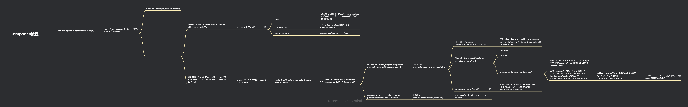

# Runtime

## Component&Element 流程



## ShapeFlags枚举类

由于整个组件挂载过程需要递归调用patch方法，因此在patch方法中需要判断传入的是组件还是元素并调用不同的方法。这里使用了ShapeFlags枚举类进行判断，ShapeFlags如下：

```JavaScript
export enum ShapeFlags {
    ELEMENT = 1,
    STATEFUL_COMPONENT = 1 << 1,
    TEXT_CHILDREN = 1 << 2,
    ARRAY_CHILDREN = 1 << 3
}
```

这里使用了位运算的方法，这样性能会更好但是可读性降低了。位运算其实就可以想象成推箱子，`1`代表数值，后面的`<<`代表向右推几格。在判断的时候使用`&`与运算符进行比较，如果判断为false的话就会返回数值0。使用`|`或运算符可以进行值的修改。
与运算：同时为`1`的时候结果才为`1`
或运算：有一个为`1`的时候结果为`1`
